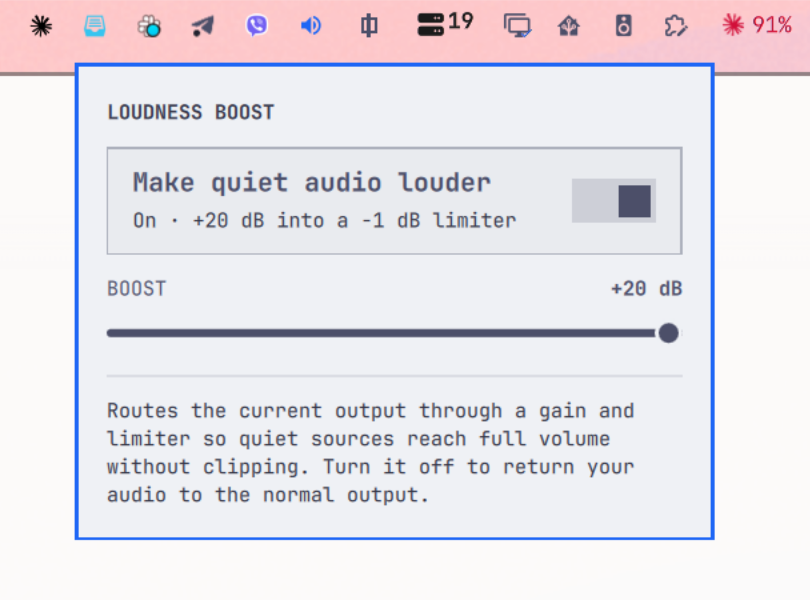

# Omarchy Loudness Boost

**Make quiet audio louder, from the Omarchy bar.**

Some videos and songs are just quiet. Turning the volume to 100% still leaves
them hard to hear, because the source itself is low. Loudness Boost routes your
output through a gain stage and a limiter, so a quiet source can be lifted up
to +30 dB without the peaks clipping and distorting.



## Install

```bash
omarchy plugin add https://github.com/nichovski/omarchy-loudness-boost.git --enable
```

Omarchy asks where to put the bar widget. That is the whole installation.

## Requirements

`lsp-plugins-lv2` provides the limiter. Omarchy installs it as part of its own
package list, so it is already there on a normal system. If it is missing:

```bash
sudo pacman -S lsp-plugins-lv2
```

## Using it

1. **Click the speaker icon** in the bar.
2. Turn on **Make quiet audio louder**, or **middle-click** the icon to toggle
   it without opening the panel.
3. Drag the **Boost** slider (0 to +30 dB) until the quiet source is loud
   enough. Changes apply live.

When the boost is on, the current output is rerouted through the gain and
limiter. Turn it off and your audio goes back to the normal output.

Under the hood it boosts the signal and holds peaks at -1 dB, so raising the
slider makes quiet parts louder while loud parts stay clear.

## Notes

- Only one output is boosted: the one that is the default when you turn it on.
  If you switch outputs while the boost is on, turn it off and on again to
  follow the new device.
- Do not run another output processor such as **EasyEffects** at the same time.
  Both create a virtual output and claim the same streams, so they fight over
  your audio.

## How it works

Loudness Boost starts a small, isolated PipeWire instance as a user systemd
service (`omarchy-loudness-boost.service`) that holds an LSP limiter and exposes
it as a virtual sink. Turning the boost on makes that sink the default output and
moves the playing streams onto it; turning it off stops the service and restores
the real output. Keeping it in its own instance means a bad filter chain cannot
take down your main audio.

State lives in `~/.config/omarchy-loudness-boost/`, and the generated PipeWire
and systemd files are written under `~/.config/pipewire/` and
`~/.config/systemd/user/`.

## Removal

```bash
omarchy plugin remove nichovski.loudness-boost
```

If the boost was on when you removed it, turn it off first (or run
`boostctl.sh disable` in the plugin folder) so your default output is restored.

## License

MIT. See [LICENSE](LICENSE).